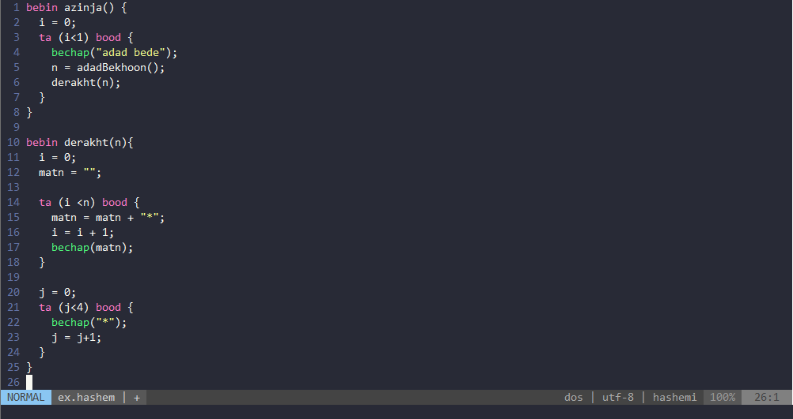

# Mr-Hashemi syntax highlight for vim
Screenshot example in dracula theme


## Installation

### Using a Plugin Manager
You can install mr-hashemi support with a vim plugin manager as usual, for example with [Plug](https://github.com/junegunn/vim-plug):

```vim
Plug 'realamirali/hashemi.vim'
```
Reload config (or save & exit vim/neovim), then:

```vim
:PlugInstall
```

### Or clone this repo and install manually
